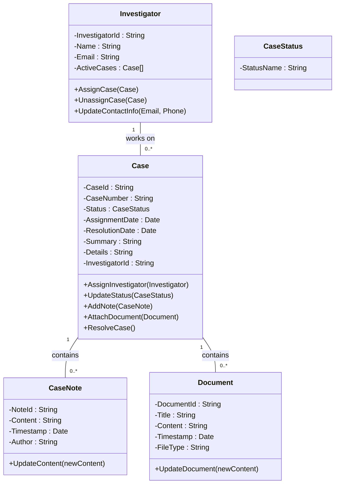

```mermaid
classDiagram
    class Case {
        -CaseId : String
        -CaseNumber : String
        -Status : CaseStatus
        -AssignmentDate : Date
        -ResolutionDate : Date
        -Summary : String
        -Details : String
        -InvestigatorId : String
        +AssignInvestigator(Investigator)
        +UpdateStatus(CaseStatus)
        +AddNote(CaseNote)
        +AttachDocument(Document)
        +ResolveCase()
    }
    class Investigator {
        -InvestigatorId : String
        -Name : String
        -Email : String
        -ActiveCases : Case[]
        +AssignCase(Case)
        +UnassignCase(Case)
        +UpdateContactInfo(Email, Phone)
    }
    class CaseNote {
        -NoteId : String
        -Content : String
        -Timestamp : Date
        -Author : String
        +UpdateContent(newContent)
    }
    class Document {
        -DocumentId : String
        -Title : String
        -Content : String
        -Timestamp : Date
        -FileType : String
        +UpdateDocument(newContent)
    }
    class CaseStatus {
        -StatusName : String
    }

    Case "1" -- "0..*" CaseNote : contains
    Case "1" -- "0..*" Document : contains
    Investigator "1" -- "0..*" Case : works on
```