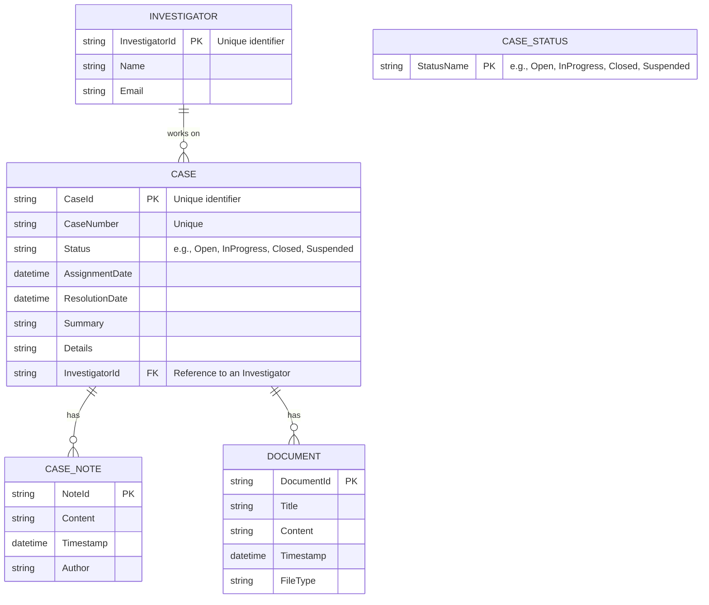

```mermaid
erDiagram
    CASE ||--o{ CASE_NOTE : "has"
    CASE {
        string CaseId PK "Unique identifier"
        string CaseNumber "Unique"
        string Status "e.g., Open, InProgress, Closed, Suspended"
        datetime AssignmentDate
        datetime ResolutionDate
        string Summary
        string Details
        string InvestigatorId FK "Reference to an Investigator"
    }
    INVESTIGATOR ||--o{ CASE : "works on"
    INVESTIGATOR {
        string InvestigatorId PK "Unique identifier"
        string Name
        string Email
    }
    CASE_NOTE {
        string NoteId PK
        string Content
        datetime Timestamp
        string Author
    }
    CASE ||--o{ DOCUMENT : "has"
    DOCUMENT {
        string DocumentId PK
        string Title
        string Content
        datetime Timestamp
        string FileType
    }
    CASE_STATUS {
        string StatusName PK "e.g., Open, InProgress, Closed, Suspended"
    }
```